<p align="center">
  
</p>

<p align="center">
  <a href="https://github.com/ji233-Sun/nexus-agent/actions/workflows/ci.yml"></a>
  <a href="https://github.com/ji233-Sun/nexus-agent/releases"></a>
  
</p>

<p align="center">
  <a href="https://github.com/ji233-Sun/nexus-agent/releases"><strong>下载应用</strong></a> ·
  <a href="#快速开始">快速开始</a> ·
  <a href="docs/usage.md">使用指南</a> ·
  <a href="docs/development.md">参与开发</a>
</p>

---

**Nexus Agent** 是一款基于 Rust 与 GPUI 的原生桌面应用。在一个工作区里选择项目、切换本地编码 Agent、跟进工具执行，并继续已有任务的会话。

支持 **Claude Code、Codex CLI、Oh My Pi（OMP）、Pi、Kimi Code、Qoder 和 CodeBuddy**，提供简体中文与 English 界面。

## 核心能力

| 会话与项目 | 配置与控制 |
| --- | --- |
| **统一时间线**<br>把回答、工具调用、执行状态和错误放在同一处，随时查看任务进展。 | **自由选择 Harness**<br>切换本地编码引擎，查看原生模型目录与可用思考层级。 |
| **原生会话续聊**<br>任务绑定原生 Session，重新打开后继续；也可只读浏览 Codex 原有历史。 | **多套服务商配置**<br>管理 API Key、Base URL 和默认模型，密钥保存在系统凭据库。 |
| **排队与 Steer**<br>运行中补充消息，排队等待下一轮，或在工具调用后介入当前任务。 | **明确的执行权限**<br>选择授权模式，在桌面处理审批；内置 Remote Web 可查看进展和停止运行。 |
| **Worktree 隔离**<br>为任务创建独立目录，最多两个 checkout 并发，消息、队列与审批分别归属各自任务。 | **本地成果接收**<br>审查完整变更、选择文件提交，再预览并合入本地分支。 |

## 下载

**[前往 GitHub Releases →](https://github.com/ji233-Sun/nexus-agent/releases)**

在对应发布版本的 **Assets** 中选择与你的系统和架构匹配的压缩包：

| 平台 | 文件名中的目标架构 | 安装 |
| --- | --- | --- |
| macOS · Apple Silicon | `aarch64-apple-darwin` | 解压 ZIP，将 `Nexus Agent.app` 移入「应用程序」 |
| macOS · Intel | `x86_64-apple-darwin` | 解压 ZIP，将 `Nexus Agent.app` 移入「应用程序」 |
| Linux · x86_64 | `x86_64-unknown-linux-gnu` | 解压 TAR.GZ，运行 `nexus-desktop`；查看[运行依赖](docs/development.md#环境要求) |
| Windows · x64 | `x86_64-pc-windows-msvc` | 解压 ZIP，运行 `nexus-desktop.exe` |

安装包已内置 Runner。发布页同时提供 `SHA256SUMS.txt` 校验文件。

> [!NOTE]
> 项目处于 Alpha 阶段，当前基础版本为 `0.1.0-alpha.1`，应用内显示当前构建的完整发布标签。Nightly 提供通过检查的新构建；本页说明以当前 main 为准，下载包能力请结合对应版本查看。macOS 包采用本地临时签名，尚未获得 Apple 公证。

## 快速开始

1. **准备一个 Harness。** 打开应用，在「设置 → 执行引擎 → Harness 管理」检查或安装要使用的 CLI。完成 CLI 登录，或配置对应的 [Provider Profile](docs/usage.md#模型与服务商)。
2. **打开本地项目。** 选择工作目录，按需使用本地或 Worktree 模式，再选好 Harness、模型和权限模式。
3. **发送你的任务。** 从时间线查看执行过程，按需回复审批或补充消息；之后打开同一任务即可继续会话。

小提示：`⌘ / Ctrl K` 搜索会话，`⌘ / Ctrl N` 新建任务，`⌘ / Ctrl Enter` 发送消息。

也可通过安装包内的原生 CLI 打开项目，无需 Node.js 或 npx。在「设置 → 通用 → 命令行」点击「安装 CLI」，重新打开终端后运行：

```sh
nexus-desktop .                # 打开当前目录
nexus-desktop "/path/to/project" # 打开指定目录（支持相对路径）
```

macOS 可直接运行 `"/Applications/Nexus Agent.app/Contents/MacOS/nexus-desktop" .`；Windows 使用 `nexus-desktop.exe`。无参数启动仍进入桌面应用，`--help` 显示用法。每次调用启动一个应用进程。

按钮将原生可执行文件所在目录加入当前用户的 `PATH`，无需管理员权限：macOS / Linux 配置 zsh、bash 或 sh 的启动文件；Windows 更新用户环境变量。现有 Shell 配置与 PATH 条目会保留。移动应用后可再次点击安装以更新路径。

在「设置 → 语音输入」先选择 Provider，再配置：MiMo ASR 支持三端，需要保存自己的 API Key，停止录音后音频会发送至 MiMo；macOS 系统 Speech 无需 Key，首次录音时申请麦克风及 Speech 权限（MiMo 只需要麦克风权限）。两者最多录制 60 秒，只将最终文本回填草稿，可编辑和撤销，不会自动发送。系统识别可能联网并将音频发送给 Apple，不承诺离线。

<details>
<summary><strong>从源码运行</strong></summary>

准备 rustup 和对应平台的[构建依赖](docs/development.md#环境要求)，然后运行：

```sh
git clone https://github.com/ji233-Sun/nexus-agent.git
cd nexus-agent
cargo run -p nexus-desktop --locked
```

仓库会自动选择 Rust 1.98.1。更多构建、测试和架构说明见[开发指南](docs/development.md)。

</details>

## 继续了解

| 你想了解 | 文档 |
| --- | --- |
| 独立目录、并发、成果接收 | [任务 Worktree](docs/usage.md#任务-worktree) |
| 续聊、排队消息与 Steer | [会话与消息](docs/usage.md#会话与消息) |
| 模型、服务商和密钥保存 | [模型与服务商](docs/usage.md#模型与服务商) |
| 三种权限模式和桌面审批 | [权限与审批](docs/usage.md#权限与审批) |
| Harness 安装、版本检测和应用更新 | [安装与更新](docs/usage.md#安装与更新) |
| 浏览器远程访问与 FRP | [远程访问](docs/usage.md#远程访问) |
| 数据保存位置和当前限制 | [数据目录](docs/usage.md#数据目录) · [已知限制](docs/usage.md#已知限制) |
| 架构、测试、发布和维护 | [开发与维护](docs/development.md) |

## 致谢

Nexus 的原生界面基于 [GPUI Kit](https://github.com/longbridge/gpui-kit)。感谢 [Vercel Design MD](https://github.com/educlopez/design-bites/blob/main/design-mds/vercel.com/DESIGN.md)、[Synara](https://github.com/Emanuele-web04/synara) 与 [t3code](https://github.com/pingdotgg/t3code) 提供的设计和实现参考。

---

<p align="center">
  <a href="https://github.com/ji233-Sun/nexus-agent/issues/new">报告问题或提出建议</a> ·
  <a href="https://github.com/ji233-Sun/nexus-agent/pulls">查看贡献</a>
</p>
