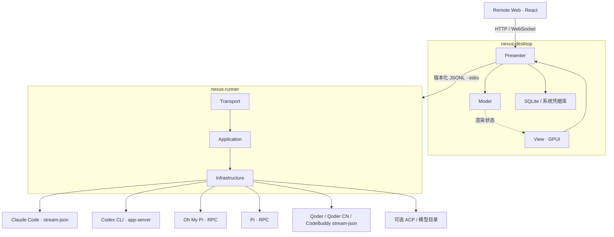

# 开发与维护

[返回首页](../README.md) · [使用指南](usage.md)

本文面向从源码构建、参与开发和维护发布的贡献者。直接使用应用请从[下载页](https://github.com/ji233-Sun/nexus-agent/releases)获取安装包。

[本地构建](#本地构建) · [架构](#架构) · [验证](#验证) · [发布](#发布) · [处理 PR 冲突](#按指令解决-pr-冲突)

## 本地构建

### 环境要求

使用 [rustup](https://rustup.rs/) 管理 Rust。仓库的 `rust-toolchain.toml` 固定为 **Rust 1.98.1**，首次运行 Cargo 时会下载所需工具链，不改变其他项目的全局默认版本。修改 Remote Web 或构建发布包时还需要 Node.js 24 与 npm。

| 平台 | 构建与运行依赖 |
| --- | --- |
| macOS | Xcode 与命令行工具 |
| Windows | MSVC 工具链、Visual Studio 的 C++ 桌面开发组件、Windows SDK、CMake |
| Linux | X11 或 Wayland；构建依赖见下方命令 |

Ubuntu / Debian：

```sh
sudo apt-get install -y clang cmake pkg-config \
  libfontconfig1-dev libfreetype6-dev libwayland-dev libx11-xcb-dev \
  libxkbcommon-x11-dev libssl-dev libvulkan1 libglib2.0-dev libasound2-dev libwebkit2gtk-4.1-dev
```

其他 Linux 发行版可参考 [GPUI / Zed 构建说明](https://zed.dev/docs/development/linux)。运行界面需要 Vulkan 驱动与桌面会话，目录选择需要 XDG Desktop Portal 及对应桌面后端。单元测试和内置 Runner 测试不要求显示服务或真实 Harness 登录。

### 启动桌面端

```sh
git clone https://github.com/ji233-Sun/nexus-agent.git
cd nexus-agent
cargo run -p nexus-desktop --locked
```

默认开发构建已开启优化，workspace 成员使用 `debug = 1` 保留有限调试信息和运行时检查，第三方依赖使用 `debug = 0`，测试配置继承这些设置。调试信息采用 `split-debuginfo = "packed"`：macOS 将其集中到 `.dSYM`，链接后可移除 `deps` 中为调试而保留的临时 `.o` 文件；链接时会增加打包步骤。此模式也支持 Linux 和 Windows MSVC。首次构建依赖较慢，后续可增量编译；评估发布性能时使用 `cargo run -p nexus-desktop --release --locked`。

Desktop 默认以独立子进程运行内置 Runner，确保两者协议版本一致。需要调试外置 Runner 时，可通过 `NEXUS_RUNNER_PATH` 指定完整路径；版本不匹配时会拒绝连接。

### 控制本地增量缓存大小

新配置不会自动删除此前保留的构建产物。从旧配置迁移时，可先执行一次 `cargo clean --profile dev --locked`，再使用下方命令重建；该操作会清理开发/测试构建缓存，保留 release 产物。

Cargo 没有增量缓存容量上限配置。通过以下包装命令，可在 Cargo 结束后，将本仓库的 `target/debug/incremental` 清理至 **5 GiB** 以内：

```sh
uv run "scripts/cargo_bounded.py" build --workspace --locked
uv run "scripts/cargo_bounded.py" test --workspace --locked
uv run "scripts/cargo_bounded.py" run -p nexus-desktop --locked
```

脚本通过 uv 管理 Python 3.12+，只使用标准库；也支持 `check` 和 `clippy`。清理会取得 Cargo 构建锁，按缓存内部最后修改时间优先删除最旧的整组缓存，保留 `deps`、可执行文件和源码。容量按硬链接去重计算；macOS/Linux 使用已分配磁盘块，Windows 使用文件大小，因此目录缩小量不等于实际释放的磁盘空间。

这是构建结束后的软上限：编译期间可能超过 5 GiB，`run` 会在程序退出后清理。普通 `cargo` 命令不会触发清理；自定义 target/build 目录、交叉编译目录和其他 profile 的缓存也不在本脚本管理范围内。构建失败后仍会尝试清理并保留 Cargo 的退出码，清理失败会明确报错。清理后再次用到被淘汰的缓存时，需要重新生成它们。

只清理现有缓存、无需重新构建：

```sh
uv run "scripts/cargo_bounded.py" prune
```

验证缓存清理逻辑（仅操作临时目录）：

```sh
uv run "scripts/cargo_bounded_test.py"
```

### 语音输入开发与发布验收

MiMo 通过 CPAL 0.16 采集（macOS CoreAudio、Windows WASAPI、Linux ALSA；不启用 JACK），按设备默认支持格式采集后编码为单声道 PCM16 WAV。Linux 需要 ALSA 开发库和可用的默认输入设备。原生识别使用 AVAudioEngine 缓冲直接对接 SFSpeechRecognizer，Objective-C 桥与 Apple 框架仅在 macOS 构建；支持现有 Apple Silicon、Intel 发布目标，不提升最低 macOS 版本。

自动测试覆盖配置持久化、凭据隔离、迟到结果、草稿撤销、WAV 编码及 Base64 大小边界；它们不能代替真实设备验收。发布前使用实际 `.app`/Windows/Linux 发布包检查：

- macOS 分别验证麦克风、Speech 首次授权、拒绝及在系统设置恢复；MiMo 不应申请 Speech 权限。包内必须含 `NSMicrophoneUsageDescription`、`NSSpeechRecognitionUsageDescription`。
- 验证无麦克风、拔出设备、取消、切换 Provider/会话、60 秒上限；取消后设备应释放且不得回填迟到文本。
- 使用用户自己的 MiMo Key 验证成功、鉴权失败、额度/限流和断网；只保存 Key 不应发起识别请求。Key 不得出现在 SQLite、日志或 Harness 环境。
- 用“检查 src/main.rs 的 parseHTTP 函数”等中文夹英文、路径、代码标识符录音；停止后只追加草稿，保留录音期间的编辑，撤销恢复回填前内容。
- 原生配置显示系统支持语言、权限、服务和设备端能力；即使设备支持设备端识别，本实现也不强制离线，不能承诺音频不上传 Apple。

### 修改远程页面

Remote Web 的构建产物会嵌入 Desktop。修改页面后，在仓库根目录执行：

```sh
npm --prefix apps/remote-web ci
npm --prefix apps/remote-web run typecheck
npm --prefix apps/remote-web run build
cargo build --workspace --locked
```

## 架构

桌面 UI 基于 [GPUI Kit 0.6](https://github.com/longbridge/gpui-kit)，复用其导航、图标、输入控件、Markdown 和设置组件，采用石墨灰主题。Desktop 使用 MVP，Runner 使用分层架构；进程入口负责装配，业务逻辑保留在各模块中。



- `crates/domain`：领域状态、模型和思考层级。
- `crates/protocol`：Desktop 与 Runner 的版本化 JSONL 协议。
- `crates/harness-core`：Harness 共用的启动规格、事件和可执行文件解析。
- `crates/harness-claude`：Claude Code 探测、启动参数和事件解码。
- `crates/harness-codex`：Codex CLI 探测、App Server 启动配置和事件适配。
- `crates/harness-omp`：Oh My Pi 探测、受控写入模式和 JSON 事件解码。
- `crates/harness-pi`：Pi RPC、临时审批扩展、原生 Session 文件与模型目录。
- `crates/harness-cli`：复用 Claude 事件解码的 Qoder / Qoder CN / CodeBuddy stream-json 接入。
- `crates/harness-acp`：Kimi Code / Qoder / CodeBuddy 共用的 ACP v1 握手、会话、模型配置、审批和事件适配。
- `apps/runner/src/transport.rs`：JSONL 命令读取、协议版本校验和事件写出。
- `apps/runner/src/application`：命令调度、双任务并发、任务与 checkout 互斥、取消和统一事件转换。
- `apps/runner/src/infrastructure`：Harness 适配器选择、子进程执行和平台相关的进程树清理。
- `apps/desktop/src/bootstrap.rs`：窗口、主题、存储和 Runner 的启动装配。
- `apps/desktop/src/model`：界面状态、会话数据和提交可用性，不依赖 GPUI。
- `apps/desktop/src/presenter`：项目选择、配置、提交、远程命令、事件处理和持久化协调，不依赖 GPUI；通过 `RunnerPort` 注入真实或测试 Runner。
- `apps/desktop/src/view`：GPUI 渲染、控件状态和事件转交，按侧栏、时间线、设置、组件和主题拆分。
- `apps/desktop/src/infrastructure`：平台数据目录、SQLite、系统凭据库、Runner 进程通信、Worktree 生命周期和本地 Git 成果接收。
- `apps/desktop/src/remote_control.rs`：带令牌鉴权的 HTTP/WebSocket 服务及静态资源托管。
- `apps/remote-web`：React + Vite 静态 Remote Client，生产构建产物嵌入 Desktop。

View 只能通过 Presenter 的只读 `model()` 获取业务状态，通过 Presenter 方法发起操作。SQLite 格式保持向后兼容；Desktop 与 Runner 使用配对的版本化 JSONL 协议，并拒绝不匹配的外置 Runner。已有领域与 Harness crate 继续复用，不额外引入框架或空 crate。

### Harness 协议

Claude Code 通过 `--print --input-format stream-json --output-format stream-json --replay-user-messages --permission-prompt-tool stdio` 收发消息，并将工具审批请求交给桌面弹窗。允许时保留原始工具输入，拒绝时将拒绝结果返回 CLI；参见[官方权限文档](https://code.claude.com/docs/en/agent-sdk/permissions)。

Codex 通过[官方 App Server 协议](https://learn.chatgpt.com/docs/app-server)运行，使用 `thread/start` / `thread/resume` 和 `turn/start`，Steer 通过带当前轮次 ID 的 `turn/steer` 注入。支持命令执行、文件变更和额外文件系统/网络权限审批；额外权限的批准仅作用于当前轮次。支持非 Git 项目，Prompt 由 stdin 传入。

OMP 通过 `omp --mode rpc-ui --approval-mode <模式>` 运行，为内置 `ask` 工具提供交互 UI；Prompt 与 Steer 同样由 stdin 传入。RPC 的选择、确认、输入和编辑器请求进入 User Ask 面板，原生工具授权使用审批弹窗。Claude Code 与 OMP 的后续轮次均通过 `--resume <SESSION_ID>` 继续原会话。

所有已接入 Harness 的 Prompt 都通过 stdin 传递，不出现在进程参数中。取消和关闭时会清理 Harness 进程树：Unix 先中断再超时终止，Windows 使用 `taskkill /T /F`。

## 验证

在仓库根目录运行：

```sh
cargo fmt --all -- --check
cargo clippy --workspace --all-targets --locked -- -D warnings
cargo test --workspace --locked
cargo build --workspace --locked
```

[CI 工作流](https://github.com/ji233-Sun/nexus-agent/blob/main/.github/workflows/ci.yml) 在推送到 main、PR 和手动触发时，于 Ubuntu、macOS、Windows 执行以上检查。Remote Web 的类型检查和静态资源构建命令见[修改远程页面](#修改远程页面)。

Presenter 测试使用内存 SQLite 与 Fake Runner，GPUI 测试验证界面交互；Fake Harness 测试验证子进程、协议、流式输出、取消和关闭，不调用真实模型。

<details>
<summary>滚动性能测试与发布构建</summary>

```sh
cargo test -p nexus-desktop --locked scroll_frame_cost -- --ignored --nocapture
cargo build --workspace --release --locked
```

滚动测试模拟触控板输入，报告侧栏和消息区 CPU 耗时的中位数与 P95；测试平台不执行 GPU 呈现，结果不代表实际帧率。该测试默认忽略。

Windows Release 的 GPUI shader 编译还需要 Windows SDK 的 `fxc.exe`，可通过 `GPUI_FXC_PATH` 指定。原生窗口、输入法、目录选择、真实 CLI 登录与发布包仍需在各系统上人工验收。

</details>

## 发布

[Release 工作流](https://github.com/ji233-Sun/nexus-agent/blob/main/.github/workflows/release.yml) 重新构建内嵌 Web Client，在四个目标上检查、测试、构建和打包。全部成功后创建 GitHub Release，附带压缩包、`SHA256SUMS.txt` 和自动生成的发布说明。README、详细指南与封面素材随安装包一起分发。

| 目标 | 格式 |
| --- | --- |
| `aarch64-apple-darwin` | ZIP，包含 `Nexus Agent.app` |
| `x86_64-apple-darwin` | ZIP，包含 `Nexus Agent.app` |
| `x86_64-unknown-linux-gnu` | TAR.GZ，包含 Desktop 与 Runner |
| `x86_64-pc-windows-msvc` | ZIP，包含 Desktop 与 Runner |

### 版本发布

先更新根目录 `Cargo.toml` 的 `workspace.package.version` 和 `Cargo.lock`，完成检查后再推送对应的 `v<版本>` 标签，例如 `v0.1.0-alpha.2`。工作流会校验标签与应用版本一致；包含预发布标识的版本标记为 Pre-release。

### Nightly

Nightly 仅在 **Actions → Release → Run workflow** 中选择分支手动触发，不再定时检查或发版。同一提交已发布过 Nightly 时跳过构建；新提交需要通过完整检查与打包流程才会发布。推送 main 只触发 CI，不触发 Nightly。

标签与包名使用 `nightly-YYYY-MM-DD-<Unix 秒时间戳>-<12 位提交 SHA>`，日期按 UTC 计算，日期与时间戳都取自该提交的提交者时间。同一提交重跑保持相同标签，标签指向完整构建 SHA，不同提交的发布独立执行。

Nightly 始终标记为 Pre-release，不占用 Latest。Cargo 包版本和 macOS 的数字基础版本沿用 `Cargo.toml`，应用内显示完整 Nightly 标签，无需每次修改版本文件。发布时通过 `NEXUS_RELEASE_TAG` 编译完整标签；本地构建优先使用显式标签，否则使用当前提交的版本标签或生成 Nightly 标签，无 Git 元数据时回退到 `v<Cargo 版本>`。应用内频道、版本展示与安装行为见[使用指南](usage.md#更新-nexus)。

## 按指令解决 PR 冲突

[Resolve PR conflicts 工作流](https://github.com/ji233-Sun/nexus-agent/blob/main/.github/workflows/resolve-conflicts.yml) 在收到 PR 评论 `/resolve-conflicts` 后，使用 DeepSeek 尝试解决合并冲突。评论中只填写这一条命令。PR 创建或追加提交不会自动调用模型，也不会启动自动审查。

启用时，将工作流合并到默认分支，并在仓库 **Settings → Secrets and variables → Actions** 中添加 `DEEPSEEK_API_KEY`。模型固定使用 `deepseek-v4-flash`，费用由对应的 DeepSeek API 账户承担；不需要 Qodo 或 OpenAI 凭据。执行前会检查评论者当前拥有 `write`、`maintain` 或 `admin` 权限。

处理过程如下：

1. 固定 PR 与默认分支的提交 SHA，在临时 runner 中准备合并。
2. 将存在冲突的文件上下文发给 DeepSeek，模型只返回各冲突区的替换内容。脚本保留冲突区外的合并结果，检查替换结构、Git 索引和 `git diff --check`。
3. 在独立任务中重新检查权限和两端 SHA，将带有两个父提交的合并提交写回原 PR 分支。采用普通推送，不强制覆盖分支；期间分支发生变化时停止写回。
4. 显式触发现有 CI，检查格式、Clippy、测试和构建，并在 PR 下报告结果及工作流链接。CI 在写回后运行，请等待通过后再合并 PR。工作流不会自动合并 PR。

模型任务只有仓库读权限，写回任务持有必要的 GitHub 写权限。两个任务均执行默认分支上的控制脚本，不执行 PR 中的程序或安装 PR 的依赖；只有后续 CI 执行项目检查。

当前支持同仓库、目标为默认分支的开放非草稿 PR，以及最多 10 个、每个不超过 128 KiB 的 UTF-8 普通文本冲突。Fork PR、修改了 GitHub 工作流或本地 Action 的 PR，以及二进制、删除、重命名、权限、符号链接和锁文件冲突需要人工处理。模型无法给出完整有效结果时停止，不推送部分修改。模型解决文本冲突不代表业务语义必然正确，仍需查看 diff 和 CI 结果。

处理脚本仅使用 Node.js 24 的内置模块；回归测试使用临时 Git 仓库和模拟 API，不产生模型费用：

```bash
node --test ".github/scripts/resolve-conflicts.test.mjs"
```

Pi 的适配位于 `crates/harness-pi`，与 OMP 共享 `harness-core::rpc` 事件解码。Pi 通过 `--mode rpc` 启动，审批扩展就绪后获取原生 Session 文件路径并发送 Prompt；后续进程通过 `--session <FILE>` 恢复。

默认 `HarnessTransport::Cli`：Qoder / Qoder CN / CodeBuddy 使用 stream-json 控制请求，初始化成功后发送用户输入。Qoder / CodeBuddy 共用 Claude 事件与问答编解码。Qoder 不传不支持的 `--verbose`，且暂不发送无接收回执保证的 steer。

Kimi Code 只支持 ACP，新会话固定使用 `kimi acp`（`HarnessTransport::Cli` 对 Kimi 不再生效）。旧版 `kimi-cli` 的 Wire 原生会话无法在 kimi-code 中恢复，续聊会按 CLI 返回的错误结束轮次；旧版 CLI 需升级到 kimi-code 后重新开始会话。Qoder / Qoder CN / CodeBuddy 可在「接入方式」中切换 `--acp`。初始化不声明文件系统与终端代理能力，工具在原 CLI 中运行。续聊优先使用服务端声明的 `session/resume`，否则使用 `session/load`；准备阶段过滤历史回放，再设置原生 `default` 权限、模型和支持的思考层级，最后发送 `session/prompt`。致命错误同时结束轮次，未知服务端请求返回 method-not-found。

ACP 模型目录通过无 Prompt 的 `session/new` 获取，CLI 可能保存空会话。模型 ID 与配置项 ID 原样保留。ACP v1 无标准 Steer 或通用 User Ask；厂商私有交互扩展不在本适配范围内。CodeBuddy 子成员事件不会混入主回答。

会话 ID 使用 `nexus:v1:` 前缀记录原生 ID、transport 及显式 CodeBuddy region。Runner 启动前恢复这些字段；未标记旧 ID 走 ACP，保证设置变化不会把原会话切换到另一协议。

本次实际验证版本：Pi 0.85.1、Kimi Code 0.42.0、Qoder CLI 1.1.48、CodeBuddy 2.147.0。Kimi Code 使用官方安装器布局（`~/.kimi-code/bin/kimi`），核对 ACP 握手、会话模式/模型配置与 `kimi -p --output-format stream-json` 文本生成；Pi 使用隔离配置和本地模拟模型验证了审批、工具、标题与跨进程续聊；Qoder 验证原生启动参数和未认证错误，国内包 1.1.48 核对命令、Token 环境变量及安装来源；CodeBuddy 验证原生握手及 ACP 模型目录。真实账号模型调用、Windows / Linux 实机运行尚未验证。

标题与提交说明统一通过 `TextGenerationConfig` / `prepare_text_generation` 执行；Kimi Code 通过 `kimi -p --output-format stream-json` 与只读 Markdown Agent（`tools: []`）生成文本，避免工具调用并限制输出为最终消息。StartRun 包含默认 CLI 的 transport，HarnessProbe 包含环境配置以支持地区探测；当前 Desktop / Runner 协议版本为 17。

### 修改 PDF 界面

`apps/pdf-viewer` 使用纯 JavaScript、PDF.js 与 pdf-lib，修改后在该目录运行 `npm ci --ignore-scripts`、`npm test`、`npm run build`，提交源码和压缩后的 `dist/` 资源。Desktop 构建时直接嵌入这些资源，发布包不依赖外部 CDN。详见 [PDF 界面说明](../apps/pdf-viewer/README.md)。图片附件将 Desktop／Runner 配对协议升级至 17，消息存储通过默认空附件列兼容已有聊天记录。
